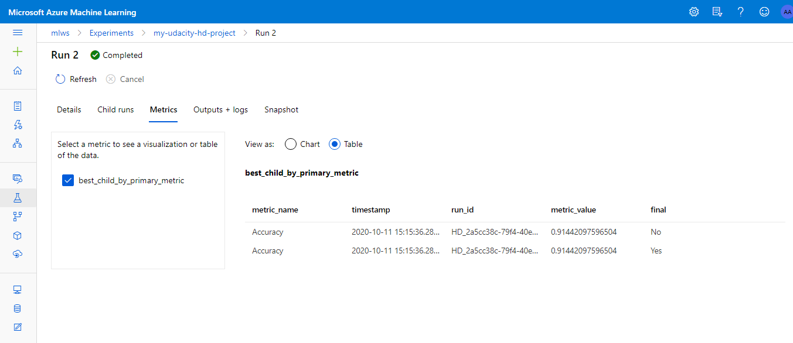

# Optimizing an ML Pipeline in Azure

## Overview
This project is part of the Udacity Azure ML Nanodegree.
In this project, we build and optimize an Azure ML pipeline using the Python SDK and a provided Scikit-learn model.
This model is then compared to an Azure AutoML run.

## Summary
In this problem we have been given a dataset of bankmarketing. In that there is a demographic profile of a customer and we want topredict whether we should give the loan to the customer.
We can use his demographic profile as independent variables to predict whether that customer is likely to default.
We used hyperdrive model (hyperparametr tuning) and an automl model for this purpose.

## Scikit-learn Pipeline
**Explain the pipeline architecture, including data, hyperparameter tuning, and classification algorithm.**

As this is a classification problem, we used Logistic Regression algorithm which is the popular algorithm especially in binary classification.
In python sklearn package has Logistic regression classifier. And therefore, we have used SKLearn estimator from azureml.

The SKLearn pipeline architecture hasgot following components.

1. Logistic Classifier:

This algorithm is required for binary classification. It contains many parameters to fine tune the performance. however here, we have used C and max_iter to control the model training.

2. Training script (train.py):

This script has a flow which is described below. It takes the dataset (bankmarketing dataset). Cleanses the data by applying maps (user defined formats).
Then partitions the data into train and test. Then trains on training partition and scores on test partition to come up with model accuracy.
However this is just a 1 run with 1 particular combination of C and max_iter parameters.

3. A compute Target: 

In this case, we have created a cluster of 4 nodes. This is auto-scalable cluster which can be used for parallelization.
Hyperdrive executes the 'runs' parallely on each cluster, therebymakingefficient use of compute resources available.

4. SKLearn Estimator:

This takes a training script with parameters mentioned above and runs that on a compute cluster we have created. 
These then become parameters of our SKLearn Estimator.

5. Hyperdrive config:

This takes above SKLearn estimator as one of the inputs.
 
It samples the parameter values by incorporating sampler technique. We have used random sampling.
Then it schedules the runs on a compute cluster parallely by using 'max_concurrent_runs' parameter.

It applies early stopping policy to terminate unwanted runs. We have used BanditPolicy for this.

It also takes primary metric and its objective. For example, here our primary metric is accuracy and its objective is of course to maximize.

After taking all the above parameters, this hyperdrive experiment selects the best Run that has the maximum accuracy.
In our case we got 91.44% accuracy.

This is how a hyperdrive run works in our case.

**What are the benefits of the parameter sampler you chose?**
Here we are given random sampler. We can choose grid sampler for better performance if we know the tentative range under which modelbehaves as expected.
We can use random sampler first to come up with the vague range and then fine tune it further using grid or Bayesian sampler.
Bayesian will always improve the primary metric by comparingit with the metric of the previous one.

We chose RandomParameterSampling as it supports early termination of low performance runs. We have C and max_iter as tuning parameters.
And more importantly, we arenot sure of their inter-relationship. Therefore we choose random sampler which will uniformly sample values of C.
It will sample uniformly the value of max_iter. 
For max_iter, we chose to discretize it since we knew the bext possible values for it.
However for C, we are not exactly sure of its best values. We therefore gave it a range from 0.6 to 1 so that it gets uniformly sampled.

**What are the benefits of the early stopping policy you chose?**
We chose slack factor as 0.1 which gives less allowance to make any errors. We cannot afford to have high value of slack, especiallygive tight resource crunch.
At the same time we gave evaluation interval as 4 so that after each 4 runs the policy would evaluate which runs to terminate based on slack value.
We chose Bandit Policy here because it offers some aggressive savings in resources' cost,precisely because we can control slack value.
If we had a high budget, then probably median stopping policy would make better sense.

## AutoML
AutoML is bt more strict for user, in the sense user doesn't have much power tocontrol the hyperparameters.
We can see the Run Settings for the autoML model here.

These above run settings are nothing but the parameters that constitute automlconfig object.

The best model selected by automl is VotingEnsemble. This model has chosen following hyperparameters as the best parameters.

The best model chosen by automl is VotingEnsemble:

## Pipeline comparison
Both the automl and hyperdrive architectures are similar however there are certain defining differences.
For example, hyperdrive offers us a greater degree of flexibility and control. We can specify the range, distribution, termination policies to govern the overall modelrun.
If we are subject matter experts, then probably it is better to run hyperdrive than automl.

In this scenario, automl gave us the best results as compared with that of hyperdrive.

This might be because automl has got the flexibility to choose different types of models.
In our case it chose votingEnsembleas the best model. In hyperdrive we had only sklearn logistic regression. Wehereas in automleven models are hyperparameters!!

## Future work
1. We can have more total number of runs, more powerful compute cluster
2. We can builda pipeline where it first runs automl and themwe can fine tune it using hyperdrive.
3. We can use other algorithms like neural network instead of conventional logistic regression.
4. There's a class imbalance detected. We can use SMOTE to balance the input data. Then run the same experiment. 

## Proof of cluster clean up
**If you did not delete your compute cluster in the code, please complete this section. Otherwise, delete this section.**
**Image of cluster marked for deletion**

